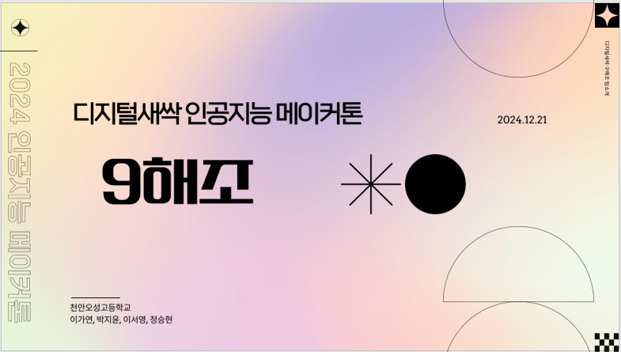
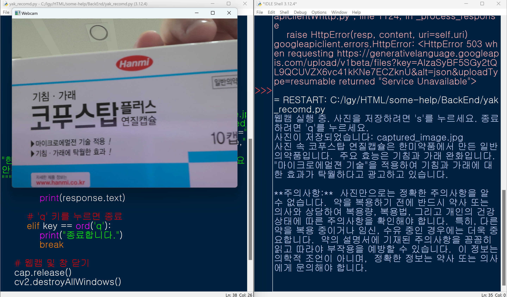
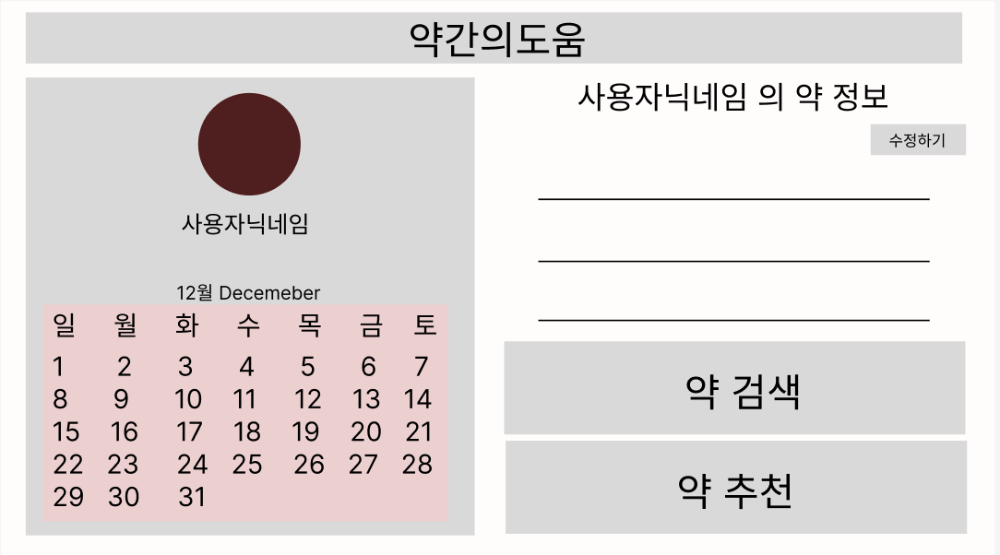

# 9해조 팀 프로젝트 소개
 

## 목차
- [팀 소개](#팀-소개)
- [프로젝트 개발 이유](#프로젝트-개발-이유)
- [프로젝트 개요](#프로젝트-개요)
- [프로젝트 기능](#프로젝트-기능)
- [실행 방법](#실행-방법)
- [어려웠던 점](#해결방법)
- [문의](#문의)

---

## 팀 소개

### 팀 이름: **9해조**

| 이름          | 역할           | GitHub Profile                                        |
|---------------|----------------|-------------------------------------------------------|
| 정승현       | 팀 대표 / 인공지능    | [@jjsshh12](https://github.com/jjsshh12)         |
| 박지윤       | 부대표 / 프론트엔드   | [@jiyouon](https://github.com/jiyouon)           |
| 이가연       | 프로그래머 / 인공지능 | [@OrdinaryYoni](https://github.com/OrdinaryYoni) |
| 이서영       | 엔지니어 / 프론트     | [@Leeseo07](https://github.com/Leeseo07)         |

---

## 프로젝트 개발 이유

약 포장지에 있는 많은 글씨들로 인하여 가독성이 떨어지거나 눈이 보이지 않아 읽지 못하여 정보 부족으로 인해 많은 사람들이 약에 대해 올바르게 알지 못하는 경우가 많습니다. 
이로 인해 잘못된 복용으로 건강 문제가 발생할 수 있으며 특히 여러 약물을 동시에 복용할 경우 위험이 더욱 커질 수 있습니다. 
또한 약에 관한 내용이 전문적이어서 일반인이 이해하기 어려운 경우도 많아 이 프로젝트를 개발하게 되었습니다.

---

## 프로젝트 개요

### 프로젝트 이름: **약간의 도움**

### 주요 기능:
- **약 성분 안내 및 추천**: Gemini api를 통해 약의 성분들을 찾아보지 않아도 간편하게 촬영하거나 약의 이름을 입력하여 성분을 자세히 알고 사용 가능
- **중복 섭취 예방**: 사용자가 복용할 약을 입력하면 인공지능이 복용할 약의 성분을 파악하여 중복된 약의 성분을 제외한 약을 추천해 중복 섭취를 예방
- **약 스케줄러**: 사용자가 건강하고 체계적으로 약을 복용할 수 있도록 약 스ㅔ줄러 기능을 제공하여 더욱 웹 사용에 편리함을 제공

### 기술 스택:
- **프론트엔드**: React, Figma
- **인공지능**: python

---

## 문의

프로젝트에 대한 문의 사항은 아래로 연락해주세요:

- **GitHub Issues**: [링크](https://github.com/jiyouon/some-help)
---

감사합니다! 🙌
